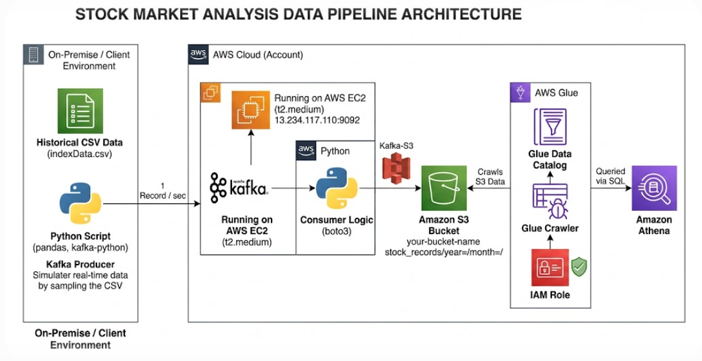

# Real-Time Stock Market Data Pipeline Using Apache Kafka (KRaft) & AWS

An end-to-end streaming data engineering architecture built to simulate, ingest, store, and analyze live stock market metrics.

---

## 📌 Project Overview
This project implements a complete distributed real-time streaming pipeline. Since accessing production-grade live financial data streams often incurs restrictive costs or API limitations, a custom ingestion framework was designed in **Python** to sample raw rows from a historical CSV dataset and stream them dynamically. 

The messaging core features an **Apache Kafka** cluster running inside an **AWS EC2** instance, utilizing the modern **KRaft (Kafka Raft)** consensus protocol instead of Zookeeper for metadata management. Downstream, an autonomous Python consumer writes streaming batches into an **AWS S3 Data Lake**. **AWS Glue Crawlers** automatically map schema changes onto a metadata catalog, allowing analytics teams to issue ad-hoc serverless SQL queries using **Amazon Athena**.

---

## 🏗️ System Architecture
The blueprint below outlines the decoupled architecture and event distribution flow:



### Core Data Life Cycle:
1. **Simulation & Production (Python):** Loads historical stock market indices from a local CSV data node, converts records randomly or sequentially into dynamic JSON payloads, and pushes them safely to a Kafka topic.
2. **Event Brokerage (AWS EC2):** An Amazon EC2 instance orchestrates an Apache Kafka cluster running in **KRaft standalone mode**. It manages partition delivery and decouples downstream components.
3. **Consumption & Storage (Python):** A multi-threaded consumer subscribes to the Kafka cluster, captures the incoming stock ticks in real time, and persists them into an AWS S3 Object Store.
4. **Data Schema Cataloging (AWS Glue):** An AWS Glue Crawler profiles the object store, automatically infers dynamic schemas, manages partitions, and maps columns to a centralized Glue Catalog database.
5. **Analytics & Query Processing (Amazon Athena):** Analysts leverage standard ANSI SQL statements to query the S3 raw storage data seamlessly without needing server infrastructure.

---

## 🛠️ Tech Stack & Infrastructure
* **Programming Languages:** Python (`pandas`, `kafka-python`, `boto3`)
* **Message Brokerage & Streaming:** Apache Kafka (KRaft mode)
* **Cloud Platform (AWS):** * Elastic Compute Cloud (EC2) - *Hosting Kafka Cluster*
  * Simple Storage Service (S3) - *Centralized Storage Lake*
  * AWS Glue Crawler & Data Catalog - *Metadata Schema Mapping*
  * Amazon Athena - *Serverless Ad-Hoc Analytics Engine*

---

## 🚀 Step-by-Step Implementation Guide

### 1. Kafka Environment Setup on AWS EC2
1. Launch an Ubuntu Server instance on AWS EC2 (`t2.medium` instance size is ideal for Kafka JVM processes).
2. Configure your EC2 Security Group to open inbound access for Port `9092` (Kafka Broker).
3. Connect to your EC2 instance via SSH, install Java, download Kafka binaries, and enter the directory:

```bash
# Update repository index and install Java JDK
sudo apt-get update
sudo apt-get install openjdk-11-jdk -y

# Download and extract Apache Kafka binaries
wget [https://archive.apache.org/dist/kafka/3.3.1/kafka_2.13-3.3.1.tgz](https://archive.apache.org/dist/kafka/3.3.1/kafka_2.13-3.3.1.tgz)
tar -xzf kafka_2.13-3.3.1.tgz
cd kafka_2.13-3.3.1

🔧 Public IP Configuration Change
By default, Kafka points to the private server interface. To allow remote clients (like your local Python scripts) to interact with the broker, you must modify the properties file so it resolves to your public EC2 IP address (13.234.117.110).

Open the configuration file using a text editor:

Bash
sudo vi config/server.properties
Locate the advertised.listeners parameter, uncomment it, and assign your EC2 Public IP:

Properties
# Tell external clients to connect via your EC2 Public IP
advertised.listeners=PLAINTEXT://13.234.117.110:9092

⚡ KRaft Initialization & Startup
Initialize your cluster log directories using a random cluster ID generated via KRaft built-in tools, format the storage directory, and spin up the server

# Generate a Unique Cluster Identifier
KAFKA_CLUSTER_ID="$(bin/kafka-storage.sh random-uuid)"

# Format the Storage Logs Directories using the Cluster ID
bin/kafka-storage.sh format --standalone -t $KAFKA_CLUSTER_ID -c config/server.properties

# Start the Standalone KRaft Kafka Server Engine
bin/kafka-server-start.sh config/server.properties
```

## Validating the Setup (CLI Verification)
To verify cluster communication and public edge connectivity, open a separate terminal session, navigate to your Kafka directory (cd kafka_2.13-4.3.0), and execute the following checks:

### A. Create the Topic
bin/kafka-topics.sh --create --topic open_stock --bootstrap-server 13.234.117.110:9092 --replication-factor 1 --partitions 1

### B. Launch Console Producer (To type mock test events manually)
bin/kafka-console-producer.sh --topic open_stock --bootstrap-server 13.234.117.110:9092

### C. Launch Console Consumer (In an additional duplicate window to observe output streams)
bin/kafka-console-consumer.sh --topic open_stock --bootstrap-server 13.234.117.110:9092 --from-beginning

## Python Producer Logic (Data Simulation)
Code available in KafkaProducer.ipynb

## Python Consumer Logic (S3 Target Ingestion)
Code available in KafkaConsumer.ipynb

## Schema Mapping & Ad-Hoc Analytics (AWS Glue & Athena)
### Glue Crawler Provisioning:

Go to the AWS Management Console ➡️ AWS Glue ➡️ Crawlers.

Create a new crawler named **stock_market_crawler**.

Set the Data Store path to target your S3 bucket root directory: 
**s3://your-stock-market-kafka-bucket-name/stock_records/**

Bind an IAM Role granting reading permissions on S3 bucket properties.

Configure the output target database (stock_market_db) and click Run Crawler.

Serverless SQL Exploration with Amazon Athena:

Open **Amazon Athena**, and switch the active database context dropdown to stock_market_db.

The underlying JSON files inside S3 are now exposed as tabular structures. 
Execute queries:
```
SELECT 
    symbol, 
    AVG(close) AS avg_closing_price, 
    MAX(high) AS highest_market_peak,
    COUNT(*) AS total_ticks_ingested
FROM "stock_market_db"."stock_records"
GROUP BY symbol
ORDER BY highest_market_peak DESC;
```